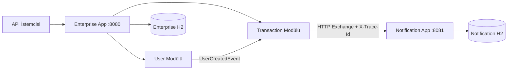
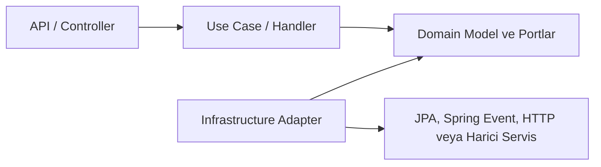
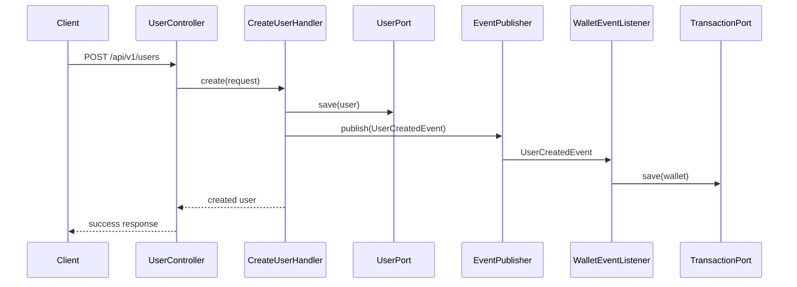
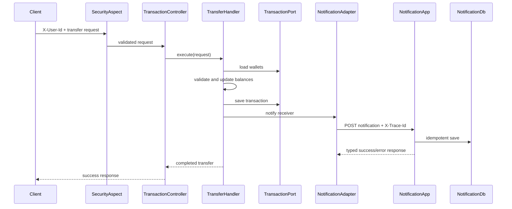

# Enterprise Banking System

Enterprise Banking System; kullanıcı, cüzdan, para transferi, raporlama ve bildirim süreçlerini örnekleyen Java 21 ve Spring Boot tabanlı bir bankacılık projesidir.

Proje iki uygulamadan oluşur:

- **Enterprise App:** Kullanıcı, cüzdan, işlem ve raporlama yeteneklerini barındıran modüler monolit.
- **Notification App:** Transfer bildirimlerini ayrı veri tabanında idempotent biçimde kaydeden bağımsız servis.

Kod tabanı; katmanlar arası bağımlılıkları portlar üzerinden sınırlandırmayı, iş kurallarını use case sınıflarında toplamayı, altyapı detaylarını adapter katmanında tutmayı ve servisler arası hata sözleşmesini açık hale getirmeyi amaçlar.

## İçindekiler

- [Temel Özellikler](#temel-özellikler)
- [Mimari Genel Bakış](#mimari-genel-bakış)
- [Modül Yapısı](#modül-yapısı)
- [Katmanlar ve Sorumluluklar](#katmanlar-ve-sorumluluklar)
- [Temel İş Akışları](#temel-iş-akışları)
- [API Referansı](#api-referansı)
- [Notification App ve Servisler Arası İletişim](#notification-app-ve-servisler-arası-iletişim)
- [Veri Modeli](#veri-modeli)
- [Güvenlik](#güvenlik)
- [Hata Yönetimi](#hata-yönetimi)
- [Loglama ve İzlenebilirlik](#loglama-ve-izlenebilirlik)
- [Test Stratejisi ve Coverage](#test-stratejisi-ve-coverage)
- [Projeyi Çalıştırma](#projeyi-çalıştırma)
- [Yapılandırma](#yapılandırma)
- [Geliştirme Rehberi](#geliştirme-rehberi)
- [Mevcut Sınırlar ve Production Yol Haritası](#mevcut-sınırlar-ve-production-yol-haritası)

## Temel Özellikler

- Kullanıcı oluşturma ve temel kullanıcı listeleme
- Kullanıcı oluşturulduğunda domain event üzerinden otomatik cüzdan oluşturma
- Cüzdanlar arası para transferi
- Kullanıcı bazlı, tarih filtreli ve sayfalı işlem geçmişi
- Aktif transfer, kullanıcı-cüzdan özeti ve sahipsiz cüzdan raporları
- Şüpheli transfer raporu
- Servisler arası Spring HTTP Exchange iletişimi
- Transfer bildirimlerinin ayrı Notification App içinde saklanması
- `eventId` tabanlı idempotent bildirim kaydı
- Servisler arasında `X-Trace-Id` aktarımı
- Tip güvenli başarı ve hata cevapları
- Bean Validation, merkezi exception handler ve SLF4J loglama
- Entity içinde UUID üretimi ve optimistic locking
- Tüm modüllerde yüzde 100 line ve branch coverage eşiği

## Mimari Genel Bakış



Enterprise App, dağıtık sistem karmaşıklığı oluşturmadan domain sınırlarını belirgin tutmak için **modüler monolit** olarak tasarlanmıştır. Notification App ise bağımsız çalıştırılabilen ayrı bir servis olarak servisler arası iletişimi, hata sözleşmelerini ve idempotency yaklaşımını gösterir.

Her modülde ana bağımlılık yönü aşağıdaki gibidir:



Bu yaklaşımın başlıca sonuçları:

- Controller yalnızca HTTP isteğini alır, doğrulanmış girdiyi use case'e aktarır ve cevabı döner.
- İş akışları handler sınıflarında yürütülür.
- Domain katmanı, JPA repository veya HTTP client gibi altyapı detaylarına doğrudan bağımlı değildir.
- Altyapı adapterları domain tarafından tanımlanan portları uygular.
- Entity kimlikleri entity tarafından üretilir; UUID üretimi listener veya controller katmanına sızmaz.
- Bildirim servisine erişim, işlem use case'inden `NotificationPort` aracılığıyla yapılır.

## Modül Yapısı

```text
enterprise-banking-system/
├── project-app/
│   ├── pom.xml
│   ├── project-common/
│   ├── project-user/
│   ├── project-transaction/
│   └── project-bootstrap/
└── project-notification/
    ├── pom.xml
    └── src/
```

### `project-common`

Modüller arasında paylaşılan teknik sözleşmeleri içerir:

- Ortak API cevap modeli
- Ortak hata cevap modeli
- Business exception yapısı
- Enterprise App merkezi exception handler'ı
- Trace ID üretimi ve MDC entegrasyonu

Ortak modül yalnızca gerçekten paylaşılan, domain bağımsız bileşenleri içerir. Kullanıcı veya işlem domainine özel davranışlar kendi modüllerinde kalır.

### `project-user`

Kullanıcı yönetimi ve kullanıcı odaklı raporların sahibidir:

- Kullanıcı oluşturma
- Temel kullanıcı listeleme
- Kullanıcı-cüzdan özet raporu
- Aktif transfer raporu
- Sahipsiz cüzdan kontrolü
- `UserCreatedEvent` yayınlama

Controller event yayınlamaz. Kullanıcı oluşturma use case'i, `UserEventPublisherPort` üzerinden eventi yayınlar; Spring event altyapısı adapter katmanında bulunur.

### `project-transaction`

Cüzdan ve para transferi domaininin sahibidir:

- Cüzdan oluşturma
- Transfer yürütme
- İşlem geçmişi
- Şüpheli transfer raporu
- Kullanıcı oluşturma eventini dinleme
- Notification App'e bildirim gönderme

`WalletEventListener`, kullanıcı oluşturma eventini dinler ve cüzdan oluşturma akışını başlatır. Cüzdan kimliği entity tarafından üretildiği için listener yalnızca iş akışı koordinasyonundan sorumludur.

### `project-bootstrap`

Enterprise App'in çalıştırılabilir modülüdür:

- Spring Boot uygulama başlangıç noktası
- Modüllerin birlikte ayağa kaldırılması
- HTTP Exchange client kurulumu
- Notification App URL ve timeout yapılandırması
- Enterprise App çalışma zamanı konfigürasyonu

### `project-notification`

Bağımsız Notification App'tir:

- Transfer bildirimlerini doğrular ve kaydeder
- Aynı `eventId` için mükerrer kayıt oluşturmaz
- Başarı ve hata cevaplarını tip güvenli sözleşmelerle döner
- Kendi merkezi exception handler'ına ve trace filtresine sahiptir
- Enterprise App'ten bağımsız veri tabanı kullanır

Notification App de Enterprise App ile aynı port-adapter sınırlarını izler:

```text
api/
├── controller/    HTTP endpointleri
├── dto/           Dış servis sözleşmeleri
└── mapper/        API DTO <-> domain dönüşümleri
domain/
├── model/         Altyapıdan bağımsız bildirim modelleri
├── port/          Persistence sözleşmesi
└── usecase/       İdempotent bildirim kayıt akışı ve iş logları
infrastructure/
├── adapter/       Domain portunun JPA uygulaması
├── entity/        Persistence entity'leri
├── mapper/        Domain <-> entity dönüşümleri
└── repository/    Spring Data repository'leri
```

`RecordNotificationHandler` yalnızca domain modelleri ve `NotificationPort` ile çalışır. Concurrent
unique-key yarışının teknik çözümü `NotificationPersistenceAdapter` içinde tutulur; controller ve
use case JPA entity veya repository detaylarını bilmez.

## Katmanlar ve Sorumluluklar

### API Katmanı

API katmanının sorumlulukları:

- HTTP endpointlerini sunmak
- Request DTO doğrulamasını tetiklemek
- Header ve query parametrelerini almak
- Use case çağırmak
- Standart response dönmek

Controller içinde repository çağrısı, event yayınlama, UUID üretme veya iş kuralı çalıştırma yapılmaz.

### Use Case / Application Katmanı

Use case handlerları tek bir iş akışını yürütür. Örnekler:

- `CreateUserHandler`
- `ExecuteTransferHandler`
- `GetTransactionHistoryHandler`
- `CheckSuspiciousTransfersHandler`

Handlerlar domain portlarına bağımlıdır. Böylece persistence, event altyapısı ve HTTP iletişimi testlerde kolayca izole edilebilir.

### Domain Katmanı

Domain katmanı:

- Entity ve domain modellerini
- İş kurallarını
- Port arayüzlerini
- Domain eventlerini

içerir. Entity kimlikleri oluşturulurken UUID üretimi entity sınırları içinde gerçekleşir. JPA yükleme ve persistence yaşam döngüsü için `@PrePersist` koruması da bulunur.

Başlıca portlar:

| Modül | Port | Amaç |
|---|---|---|
| User | `UserPort` | Kullanıcı persistence işlemleri |
| User | `ReportPort` | Rapor sorguları |
| User | `UserEventPublisherPort` | Kullanıcı domain eventlerini yayınlama |
| Transaction | `TransactionPort` | Cüzdan ve işlem persistence işlemleri |
| Transaction | `NotificationPort` | Bildirim gönderme |

### Infrastructure / Adapter Katmanı

Adapterlar portların teknik uygulamasını sağlar:

- JPA persistence adapterları
- Spring Event publisher adapterı
- Spring Event listener
- HTTP Exchange notification adapterı
- Repository ve mapper bileşenleri

Bu sayede bir altyapı seçimi değiştiğinde use case ve domain kodunun etkilenmesi azaltılır.

## Temel İş Akışları

### Kullanıcı Oluşturma ve Cüzdan Açma



Akış özellikleri:

- Kullanıcı kaydı use case içinde oluşturulur.
- Event publisher controller yerine service/use case katmanında kullanılır.
- Event, aynı Enterprise App süreci içinde Spring Event ile senkron işlenir.
- Yeni cüzdan başlangıç bakiyesiyle oluşturulur.
- Kullanıcı ve cüzdan UUID değerleri entity tarafından üretilir.

### Transfer ve Bildirim



Transfer sırasında:

1. `X-User-Id` header'ı kontrol edilir.
2. Header'daki kullanıcı ile gönderen kullanıcının aynı olması doğrulanır.
3. Gönderen ve alıcı cüzdanları yüklenir.
4. Bakiye ve transfer kuralları kontrol edilir.
5. Bakiyeler güncellenir ve işlem kaydı `COMPLETED` olarak saklanır.
6. Alıcı için Notification App'e bildirim gönderilir.
7. Bildirim hatası ayrıntılı biçimde loglanır; tamamlanmış transfer cevabı korunur.

## API Referansı

### Enterprise App

Varsayılan adres: `http://localhost:8080`

| Metot | Endpoint | Açıklama | Gerekli Header |
|---|---|---|---|
| `POST` | `/api/v1/users` | Kullanıcı oluşturur | - |
| `GET` | `/api/v1/users/basic-list` | Temel kullanıcı listesini döner | - |
| `GET` | `/api/v1/admin/reports/user-wallet-summary` | Kullanıcı-cüzdan özetini döner | - |
| `GET` | `/api/v1/admin/reports/active-transfers` | Aktif transfer raporunu döner | - |
| `GET` | `/api/v1/admin/reports/health/orphan-wallets` | Sahipsiz cüzdanları döner | - |
| `POST` | `/api/v1/transactions/transfer` | Para transferi yapar | `X-User-Id` |
| `GET` | `/api/v1/transactions/history` | Kullanıcının işlem geçmişini döner | `X-User-Id` |
| `GET` | `/api/v1/transactions/fraud-report` | Şüpheli transfer raporunu döner | `X-User-Id`, `X-Role: ADMIN` |
| `DELETE` | `/api/v1/users/{userId}` | Yalnızca kullanıcı kaydını siler; bulunamazsa `404` döner | - |
| `DELETE` | `/api/v1/transactions/wallets/{walletId}` | Wallet ID ile yalnızca ilgili cüzdanı siler; sahiplik kontrolü yapar | `X-User-Id` |

#### Kullanıcı Oluşturma

```http
POST /api/v1/users
Content-Type: application/json

{
  "username": "demo-user",
  "email": "demo@example.com",
  "password": "strong-password"
}
```

Doğrulama kuralları:

- `username`: 3-50 karakter
- `email`: geçerli e-posta formatı
- `password`: en az 8 karakter

#### Transfer

```http
POST /api/v1/transactions/transfer
Content-Type: application/json
X-User-Id: sender-user-id
X-Trace-Id: optional-client-trace-id

{
  "senderUserId": "sender-user-id",
  "receiverUserId": "receiver-user-id",
  "amount": 25.00
}
```

`amount` değeri en az `0.01` olmalıdır.

#### İşlem Geçmişi

```http
GET /api/v1/transactions/history?userId=user-id&startDate=2026-01-01T00:00:00&endDate=2026-12-31T23:59:59&page=0&size=20
X-User-Id: user-id
```

Header'daki kullanıcı yalnızca kendi işlem geçmişini görüntüleyebilir.

#### User ve Wallet Silme Cevapları

Başarılı silme işlemleri HTTP `200 OK` ve standart başarılı cevap döner:

```json
{
  "success": true,
  "message": "User deleted successfully.",
  "data": null
}
```

İlgili user veya wallet bulunamadığında HTTP `404 Not Found` ve standart başarısız cevap döner:

```json
{
  "success": false,
  "message": "User not found with ID: requested-user-id",
  "data": null
}
```

Wallet silme isteğinde path parametresi wallet ID'dir:

```http
DELETE /api/v1/transactions/wallets/wallet-id
X-User-Id: wallet-owner-user-id
```

Wallet mevcut olsa bile `X-User-Id` wallet sahibine ait değilse HTTP `403 Forbidden` ve başarısız `GenericResponse` döner. Sahiplik kontrolü controller yerine `DeleteWalletHandler` içinde uygulanır.

### Notification App

Varsayılan adres: `http://localhost:8081`

| Metot | Endpoint | Açıklama |
|---|---|---|
| `POST` | `/api/v1/notifications` | Bildirimi idempotent biçimde kaydeder |

Yeni kayıt için HTTP `201 Created`, daha önce işlenmiş aynı `eventId` için HTTP `200 OK` döner.

## Notification App ve Servisler Arası İletişim

Enterprise App ile Notification App arasındaki iletişim Spring **HTTP Exchange** kullanılarak yapılır. Client sözleşmesi annotation tabanlıdır ve altyapıda `RestClient` ile çalışır.

```java
@HttpExchange("/api/v1/notifications")
public interface NotificationHttpExchangeClient {

    @PostExchange
    NotificationResponse createNotification(
            @RequestHeader("X-Trace-Id") String traceId,
            @RequestBody NotificationRequest request);
}
```

### Bildirim İsteği

```json
{
  "eventId": "transaction-uuid",
  "type": "TRANSFER_RECEIVED",
  "sourceService": "enterprise-app",
  "recipientId": "receiver-user-id",
  "title": "Transfer received",
  "message": "You received a transfer of 25.0 TRY.",
  "referenceId": "transaction-uuid",
  "amount": 25.0,
  "currency": "TRY"
}
```

Alanların anlamı:

| Alan | Açıklama |
|---|---|
| `eventId` | İdempotency anahtarı; transfer kimliğiyle ilişkilidir |
| `type` | Bildirim türü |
| `sourceService` | Bildirimi üreten servis |
| `recipientId` | Bildirimin hedef kullanıcısı |
| `title` | Kısa bildirim başlığı |
| `message` | Kullanıcıya gösterilecek açıklama |
| `referenceId` | Kaynak işleme ait referans |
| `amount` | Transfer tutarı |
| `currency` | Üç karakterli para birimi |

Doğrulama kuralları:

- `eventId`, `sourceService`, `recipientId` ve `referenceId` boş olamaz.
- `type` zorunludur.
- `title` en fazla 255 karakterdir.
- `message` en fazla 1000 karakterdir.
- `amount` pozitif olmalıdır.
- `currency` tam olarak 3 karakter olmalıdır.

### Başarılı Cevap

```json
{
  "notificationId": "notification-uuid",
  "eventId": "transaction-uuid",
  "status": "RECORDED",
  "duplicate": false,
  "createdAt": "2026-06-09T12:00:00"
}
```

### İdempotency

Notification App, `eventId` alanını unique olarak saklar:

- İlk istek yeni bildirim oluşturur ve `duplicate: false` döner.
- Aynı `eventId` ile sonraki istekler mevcut kaydı döner ve `duplicate: true` işaretlenir.
- Eş zamanlı isteklerde oluşabilecek unique constraint yarışı ayrıca ele alınır.

Bu davranış, istemci tekrar denemelerinde aynı iş olayı için birden fazla bildirim kaydı oluşmasını engeller.

### Timeout ve Hata Davranışı

Enterprise App varsayılan olarak:

- Bağlantı kurulması için `2s`
- Cevap okunması için `3s`

timeout kullanır.

Notification App'ten dönen tip güvenli hata cevabı `NotificationDeliveryException` içine dönüştürülür. Bu exception HTTP status, hata kodu ve trace ID bilgisini taşır. Notification App'e erişilememesi veya geçersiz cevap alınması da ayrı hata kodlarıyla loglanır.

Mevcut iş kuralına göre notification gönderimi **best effort** çalışır: bildirim hatası transferin başarılı sonucunu geri almaz.

## Veri Modeli

### Enterprise App Veri Tabanı

Varsayılan bağlantı: `jdbc:h2:mem:enterprisedb`

#### `users`

| Alan | Açıklama |
|---|---|
| `id` | Entity tarafından üretilen UUID |
| `username` | Unique kullanıcı adı |
| `email` | Unique e-posta |
| `is_active` | Kullanıcı aktiflik durumu |
| `created_at` | Oluşturulma zamanı |
| `version` | Optimistic locking sürümü |

#### `wallets`

| Alan | Açıklama |
|---|---|
| `id` | Entity tarafından üretilen UUID |
| `user_id` | Unique kullanıcı ilişkisi |
| `balance` | Cüzdan bakiyesi |
| `version` | Optimistic locking sürümü |

#### `transaction_records`

| Alan | Açıklama |
|---|---|
| `id` | Entity tarafından üretilen UUID |
| `sender_user_id` | Gönderen kullanıcı |
| `receiver_user_id` | Alıcı kullanıcı |
| `amount` | Transfer tutarı |
| `transaction_date` | İşlem zamanı |
| `status` | İşlem durumu |

### Notification App Veri Tabanı

Varsayılan bağlantı: `jdbc:h2:mem:notificationdb`

#### `notifications`

| Alan | Açıklama |
|---|---|
| `id` | Entity tarafından üretilen UUID |
| `event_id` | Unique ve değiştirilemez idempotency anahtarı |
| `type` | Bildirim türü |
| `source_service` | Kaynak servis |
| `recipient_id` | Hedef kullanıcı |
| `title` | Bildirim başlığı |
| `message` | Bildirim açıklaması |
| `reference_id` | Kaynak işlem referansı |
| `amount` | `BigDecimal`, precision 19 ve scale 4 |
| `currency` | Üç karakterli para birimi |
| `status` | Bildirim durumu |
| `created_at` | Oluşturulma zamanı |

## Güvenlik

Mevcut güvenlik modeli örnek ve geliştirme amaçlıdır.

`SecurityHeaderAspect`, transaction controller çağrılarında `X-User-Id` header'ını zorunlu tutar. `TransactionAccessValidator` ise:

- Transfer göndereninin header kullanıcısıyla aynı olduğunu
- Kullanıcının yalnızca kendi işlem geçmişine eriştiğini
- Fraud report isteğinin `X-Role: ADMIN` taşıdığını

doğrular.

Bu yaklaşım gerçek kimlik doğrulama değildir; header değerleri istemci tarafından güvenilir kabul edilir. Production ortamında JWT/OAuth2 tabanlı kimlik doğrulama ve yetkilendirme kullanılmalıdır.

## Hata Yönetimi

Enterprise App ve Notification App kendi merkezi exception handler'larına sahiptir. Handlerlar ayrı `handler` paketlerinde tutulur ve controller sorumluluklarından ayrılır.

### Enterprise App

| Hata | HTTP Status |
|---|---|
| Yetkisiz kaynak erişimi | `403 Forbidden` |
| Kaynak bulunamadı | `404 Not Found` |
| Business exception | `400 Bad Request` |
| Validation hatası | `400 Bad Request` |
| Data integrity ihlali | `409 Conflict` |
| Beklenmeyen hata | `500 Internal Server Error` |

### Notification App

Örnek hata cevabı:

```json
{
  "timestamp": "2026-06-09T12:00:00",
  "status": 400,
  "errorCode": "NOTIFICATION_REQUEST_INVALID",
  "message": "Notification request validation failed.",
  "traceId": "trace-id",
  "path": "/api/v1/notifications",
  "validationErrors": {
    "recipientId": "Recipient ID cannot be blank"
  }
}
```

Notification App hata kodları:

| Hata Kodu | HTTP Status | Açıklama |
|---|---:|---|
| `NOTIFICATION_REQUEST_INVALID` | 400 | Request validation başarısız |
| `NOTIFICATION_REQUEST_UNREADABLE` | 400 | Request body okunamadı |
| `NOTIFICATION_PERSISTENCE_UNAVAILABLE` | 503 | Bildirim kalıcı olarak saklanamadı |
| `NOTIFICATION_UNEXPECTED_ERROR` | 500 | Beklenmeyen servis hatası |

Enterprise App notification adapter hata kodları:

| Hata Kodu | Açıklama |
|---|---|
| `NOTIFICATION_HTTP_ERROR` | Notification App bir HTTP hata cevabı döndürdü |
| `NOTIFICATION_SERVICE_UNAVAILABLE` | Notification App'e erişilemedi veya geçerli cevap alınamadı |

## Loglama ve İzlenebilirlik

Her iki uygulama da SLF4J kullanır. Trace filtreleri:

1. İstekte gelen `X-Trace-Id` değerini kullanır.
2. Header yoksa yeni trace ID üretir.
3. Trace ID'yi MDC içine ekler.
4. Servisler arası istekte aynı trace ID'yi aktarır.
5. Cevap header'ında trace ID'yi döner.

Notification akışında başarı, duplicate kayıt, validation hatası, persistence hatası, HTTP hatası ve erişim hatası ayrı log olaylarıyla kapsanır. Başlıca olay aileleri:

- `notification.record.*`
- `notification.client.*`
- `notification.dispatch.*`

Loglarda mümkün olduğunca `eventId`, `referenceId`, `recipientId`, hata kodu, HTTP status ve trace ID gibi operasyonel olarak anlamlı alanlar bulunur.

Controller sınıfları log üretmez. İş girdileri, uygulanan kararlar ve sonuçlar use case/service katmanında; event kaynaklı işlemler listener katmanında; teknik iletişim ayrıntıları ise ilgili adapter ve exception handler katmanında loglanır.

## Test Stratejisi ve Coverage

Projede JUnit 5, Mockito ve AssertJ kullanılır. Testler aşağıdaki davranışları kapsar:

- Controller request/response sözleşmeleri
- Validation ve exception handler davranışları
- Use case başarı ve hata senaryoları
- Domain entity yaşam döngüsü ve UUID üretimi
- Persistence ve event adapterları
- Güvenlik header ve rol kontrolleri
- Notification idempotency ve eş zamanlı kayıt yarışı
- HTTP Exchange başarı, tip güvenli hata ve bağlantı hataları
- Trace ID üretimi ve aktarımı

JaCoCo her modülde yüzde 100 line ve branch coverage eşiğini zorunlu tutar. Doğrulanan mevcut durumda toplam **176 test** başarıyla çalışmaktadır.

Enterprise App ve Notification App birbirinden bağımsız Maven projeleridir. Repository kökünde parent
veya aggregator POM bulunmaz; her uygulama kendi dizinindeki Maven Wrapper ve POM ile doğrulanır.

Testleri ve coverage doğrulamasını çalıştırmak için:

```powershell
cd project-app
.\mvnw.cmd clean verify

cd ..\project-notification
.\mvnw.cmd clean verify
```

JaCoCo raporları:

- `project-app/project-common/target/site/jacoco/index.html`
- `project-app/project-user/target/site/jacoco/index.html`
- `project-app/project-transaction/target/site/jacoco/index.html`
- `project-app/project-bootstrap/target/site/jacoco/index.html`
- `project-notification/target/site/jacoco/index.html`

## Projeyi Çalıştırma

### Gereksinimler

- Java 21
- Maven 3.9+

Önce Notification App'i çalıştırın:

```powershell
cd project-notification
mvn spring-boot:run
```

Ardından ayrı terminalde Enterprise App'i çalıştırın:

```powershell
cd project-app
mvn -pl project-bootstrap -am spring-boot:run
```

Uygulamalar:

- Enterprise App: `http://localhost:8080`
- Notification App: `http://localhost:8081`
- Enterprise H2 Console: `http://localhost:8080/h2-console`
- Notification H2 Console: `http://localhost:8081/h2-console`

Alternatif olarak paket oluşturup jar dosyaları çalıştırılabilir:

```powershell
cd project-app
mvn clean package
java -jar project-bootstrap\target\project-bootstrap-0.0.1-SNAPSHOT.jar
```

```powershell
cd project-notification
mvn clean package
java -jar target\notification-0.0.1-SNAPSHOT.jar
```

## Yapılandırma

Enterprise App varsayılanları:

| Ayar | Varsayılan |
|---|---|
| Server port | `8080` |
| Veri tabanı | `jdbc:h2:mem:enterprisedb` |
| Notification base URL | `http://localhost:8081` |
| Notification connect timeout | `2s` |
| Notification read timeout | `3s` |

Notification App varsayılanları:

| Ayar | Varsayılan |
|---|---|
| Server port | `8081` |
| Veri tabanı | `jdbc:h2:mem:notificationdb` |

Her iki uygulama da geliştirme kolaylığı için H2 console sunar. H2 bellek veri tabanı kullanıldığı için uygulamalar kapatıldığında veriler kaybolur.

## Geliştirme Rehberi

Yeni bir özellik eklerken önerilen sıra:

1. İş kuralını ve domain modelini ilgili domain modülünde tanımlayın.
2. Harici bağımlılık gerekiyorsa domain katmanında küçük ve amaca özel bir port oluşturun.
3. Tek iş akışından sorumlu use case/handler sınıfını ekleyin.
4. JPA, HTTP veya event entegrasyonunu infrastructure adapter olarak uygulayın.
5. Controller'ı yalnızca HTTP sözleşmesi ve use case çağrısıyla sınırlı tutun.
6. Başarı, validation, business error ve altyapı hata senaryoları için test ekleyin.
7. `mvn clean verify` ile tüm modülleri ve coverage eşiklerini doğrulayın.

Kod tabanında korunması beklenen prensipler:

- Her sınıfın tek ve açık bir sorumluluğu olmalıdır.
- Controller içinde iş kuralı, event yayınlama veya persistence kodu bulunmamalıdır.
- Domain katmanı framework ve altyapı detaylarına bağımlı olmamalıdır.
- UUID gibi entity yaşam döngüsü detayları entity içinde kalmalıdır.
- Harici servis iletişimi port ve adapter üzerinden yürütülmelidir.
- Loglar hatayı yalnızca metin olarak değil, bağlamıyla birlikte açıklamalıdır.
- Yeni hata durumları merkezi handler sözleşmesine dahil edilmelidir.

## Mevcut Sınırlar ve Production Yol Haritası

Bu proje mimari yaklaşımı ve entegrasyon desenlerini göstermek için hazırlanmıştır. Production kullanımı öncesinde aşağıdaki alanlar geliştirilmelidir.

### Finansal Hassasiyet

Enterprise App cüzdan ve transaction tutarlarında şu anda `Double` kullanır. Finansal hesaplarda kayan nokta yuvarlama sorunlarını önlemek için tüm parasal alanlar `BigDecimal` ve veri tabanında uygun `DECIMAL` tipine taşınmalıdır.

### Kimlik Doğrulama ve Yetkilendirme

Mevcut header tabanlı güvenlik yalnızca örnek amaçlıdır. Önerilen geliştirmeler:

- Spring Security
- OAuth2 Resource Server
- JWT doğrulama
- Role ve permission tabanlı yetkilendirme
- Servisler arası mTLS veya service credential

### Şifre Yönetimi

Kullanıcı oluşturma isteğinde password doğrulanır ancak mevcut örnekte bilerek saklanmaz. Gerçek sistemde password:

- BCrypt veya Argon2 ile hashlenmeli
- Ayrı credential modeliyle yönetilmeli
- Düz metin olarak hiçbir zaman loglanmamalı veya saklanmamalıdır

### Veri Tabanı

H2 ve `ddl-auto: update` geliştirme ortamı için uygundur. Production ortamında:

- PostgreSQL gibi kalıcı veri tabanı
- Flyway veya Liquibase migration
- Veri tabanı constraint ve index incelemesi
- Backup ve recovery planı

kullanılmalıdır.

### Bildirim Güvenilirliği

Bildirim çağrısı şu anda senkron ve best effort çalışır. Harici HTTP çağrısı transfer transaction'ı tamamlanmadan önce yapılabildiği için production tasarımında önerilen yaklaşım:

1. Transfer ile birlikte outbox kaydı oluşturmak.
2. Outbox kaydını commit sonrasında yayınlamak.
3. Kafka veya RabbitMQ üzerinden Notification App'e iletmek.
4. Retry, dead-letter queue ve operasyonel alarm eklemek.

Bu yaklaşım transfer ile bildirim olayı arasındaki güvenilirliği artırır ve harici servis gecikmesinin veri tabanı transaction süresini uzatmasını engeller.

### Dayanıklılık

HTTP iletişimi için timeout mevcuttur. Production için ek olarak:

- Resilience4j retry
- Circuit breaker
- Bulkhead
- Rate limiting
- Ölçüm ve alarm eşikleri

değerlendirilmelidir.

### Gözlemlenebilirlik

Trace ID ve yapılandırılmış log alanları temel izlenebilirliği sağlar. İleri seviye kullanım için:

- OpenTelemetry distributed tracing
- Micrometer metrics
- Prometheus ve Grafana
- Merkezi log toplama
- Hata oranı ve gecikme alarmları

eklenebilir.

### Yapılandırılabilir İş Kuralları

Yeni cüzdanın başlangıç bakiyesi şu anda sabit bir değerdir. Production ortamında bu ve benzeri iş kuralları doğrulanmış, versiyonlanabilir yapılandırmalar üzerinden yönetilmelidir.

## Önemli Kod Noktaları

- [Enterprise App başlangıç ve konfigürasyon modülü](project-app/project-bootstrap)
- [Ortak hata ve trace bileşenleri](project-app/project-common)
- [Kullanıcı domaini ve use case'leri](project-app/project-user)
- [Transaction domaini ve notification adapterı](project-app/project-transaction)
- [Bağımsız Notification App](project-notification)
