# Enterprise Banking System - Software Design Interview Case

Bu doküman, mevcut Transaction System projesini bir software design interview case'i gibi anlatmak için hazırlanmıştır. İlk kısım mevcut sistemi açıklar; ikinci kısım aynı problemi daha büyük ölçekli enterprise ortamda tasarlasaydım hangi mimari kararları alacağımı gösterir.

GitHub ve birçok Markdown viewer Mermaid diyagramlarını doğrudan render eder.

## 1. Problem Statement

Bir bankacılık sisteminde kullanıcılar hesap oluşturur, her kullanıcıya cüzdan açılır, kullanıcılar arası para transferi yapılır, transfer geçmişi ve admin raporları görüntülenir, şüpheli işlemler raporlanır ve alıcıya bildirim gönderilir.

Tasarımın hedefi:

- Para hareketlerinde tutarlılık ve audit izini korumak
- Kimlik doğrulama ve rol bazlı yetkilendirmeyi merkezi yönetmek
- Transfer akışını idempotent, izlenebilir ve hata durumlarına dayanıklı yapmak
- Raporlama ve bildirim gibi yan etkileri core transfer işleminden ayrıştırmak
- Monolitten gerektiğinde servis tabanlı mimariye evrilebilecek sınırlar kurmak

## 2. Assumptions

Interview sırasında netleştireceğim varsayımlar:

| Konu | Varsayım |
|---|---|
| Para birimi | İlk fazda TRY; target design çoklu para birimini destekler |
| Transfer türü | Kullanıcı cüzdanları arasında internal transfer |
| Tutarlılık | Debit-credit ve ledger kaydı güçlü tutarlı olmalı |
| Notification | Best effort; transfer başarısını geri almamalı |
| Fraud | İlk fazda raporlama; target design'da pre-check ve post-check olabilir |
| Auth | Mevcut sistemde JWT + role based auth; enterprise target'ta OIDC/IAM entegrasyonu |
| Ölçek | Tasarım yatay ölçeklenebilir olmalı; transaction write path dikkatli partition edilmeli |

## 3. Requirements

### Functional Requirements

- User registration
- Login, refresh token, logout
- Role based access control
- Wallet provisioning on user creation
- Wallet-to-wallet transfer
- Transaction history with pagination and filtering
- Fraud report
- Admin reports
- Idempotent notification recording
- Traceable audit data

### Non-Functional Requirements

| Requirement | Target |
|---|---|
| Correctness | Bir transferde debit ve credit birlikte başarılı olmalı veya birlikte rollback edilmeli |
| Security | JWT/OIDC, RBAC, ownership checks, mTLS, secrets management |
| Availability | Core transfer path notification hatalarından etkilenmemeli |
| Latency | Transfer p95 düşük tutulmalı; ağır fraud/report işlemleri async/read model tarafına taşınmalı |
| Auditability | Her para hareketi immutable ledger ve audit event ile izlenmeli |
| Observability | Trace ID, structured logs, metrics, alerts, audit trail |
| Scalability | Read-heavy raporlar CQRS/read replica ile ayrılmalı |
| Resilience | Timeout, retry, circuit breaker, DLQ, idempotency key |

## 4. Current Architecture

Mevcut proje iki uygulamadan oluşur:

- Enterprise App: User, Transaction, Common ve Bootstrap modüllerini içeren modüler monolit
- Notification App: Ayrı çalışan, kendi veritabanına sahip bildirim servisi

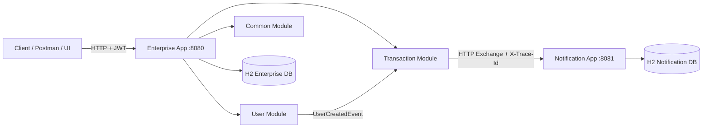

### Current Component Diagram

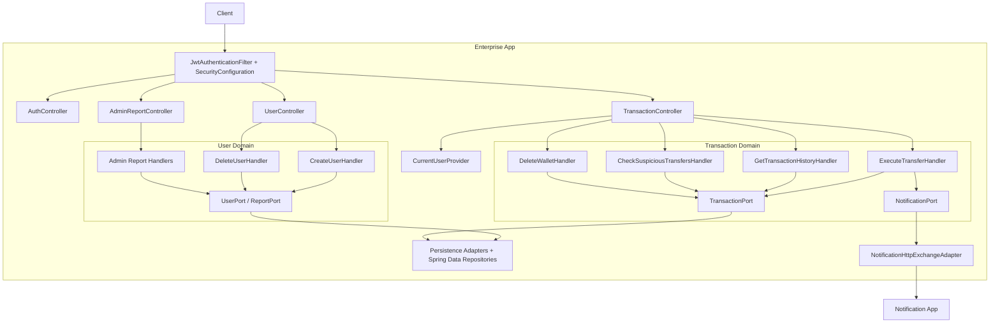

### Current Layering

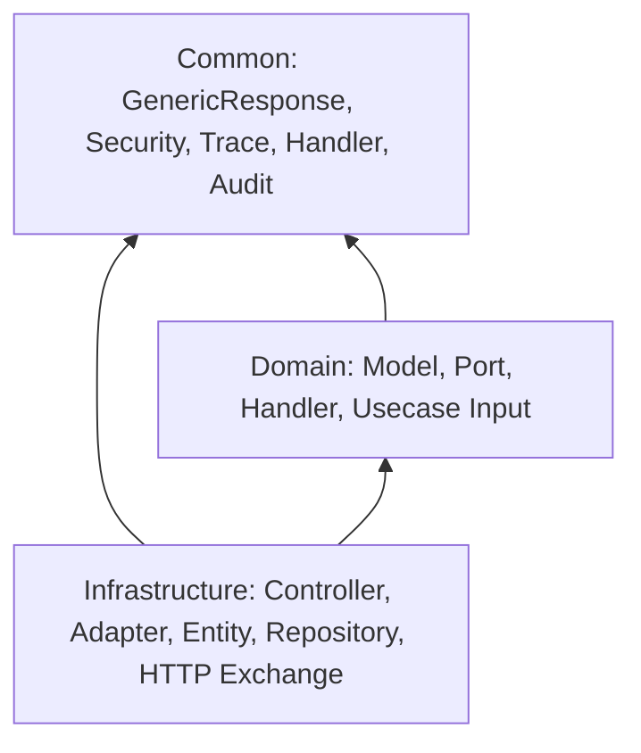

Kural: Domain portları altyapı detaylarını bilmez. Controller doğrudan repository, event publisher veya UUID generation yapmaz.

## 5. Target Enterprise Architecture

Enterprise ölçekte bu sistemi event-driven, ledger merkezli ve servis sınırları net olacak şekilde tasarlardım. İlk deploy yine modüler monolit olabilir; fakat bounded context sınırları servisleşmeye hazır tutulur.

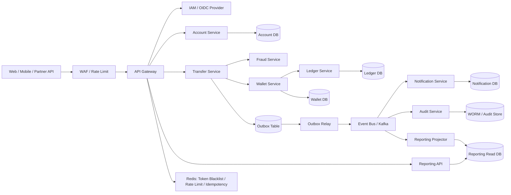

### Why This Split

| Bounded Context | Responsibility | Scaling Characteristic |
|---|---|---|
| Account Service | User profile, KYC, lifecycle | Read-heavy |
| Auth/IAM | Identity, roles, sessions | Security-critical |
| Wallet Service | Balance view, wallet ownership | Hot write path |
| Ledger Service | Immutable double-entry movements | Correctness-critical |
| Transfer Service | Orchestration, idempotency, fraud decision | Latency-sensitive |
| Notification Service | Idempotent customer notification | Async, retry-heavy |
| Reporting Service | Admin reports, fraud reports, history projections | Read-heavy |
| Audit Service | Immutable compliance events | Append-only |

## 6. C4-Style Diagrams

### System Context

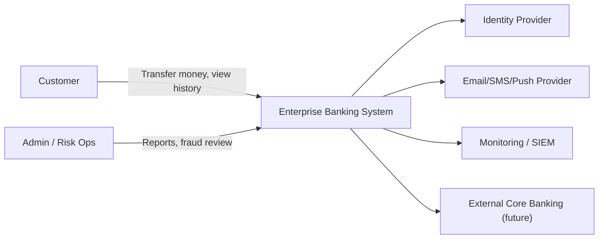

### Container View

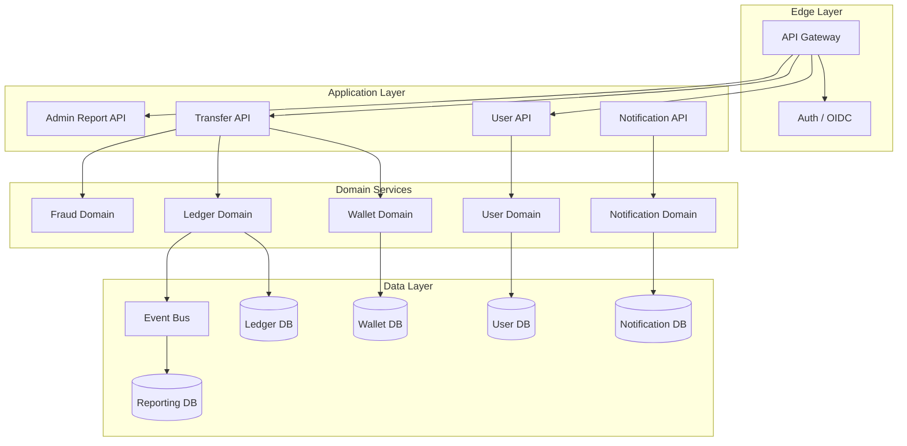

## 7. Data Model

### Current Logical ERD

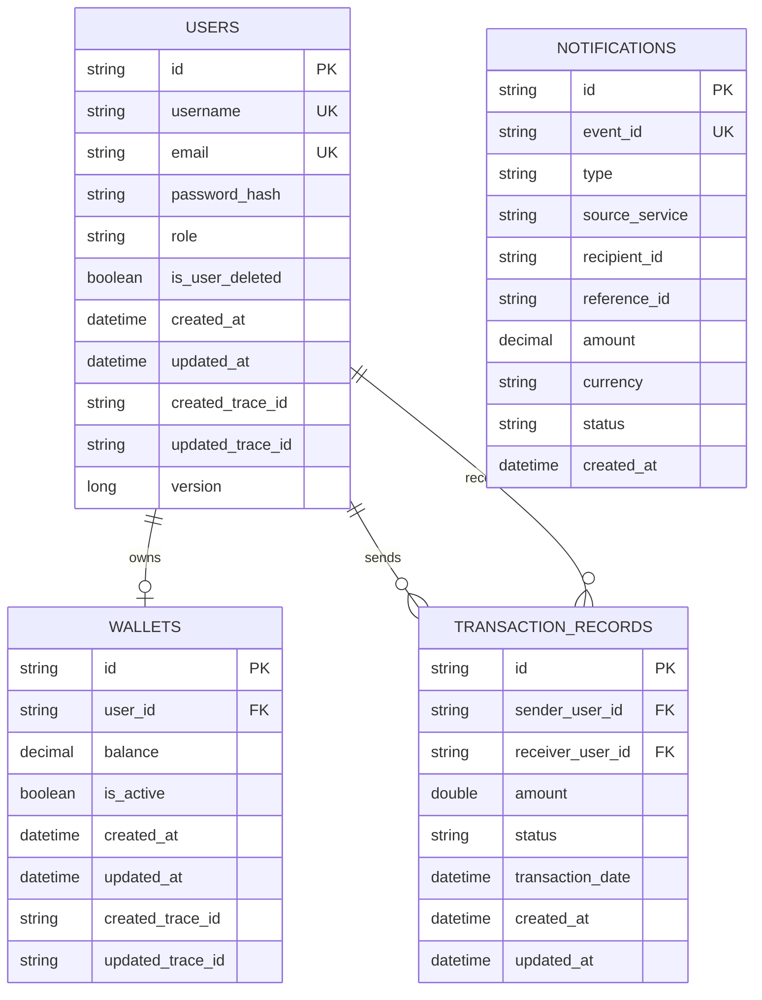

### Target Enterprise Ledger Model

Mevcut model transfer kaydı ve wallet balance için yeterli. Enterprise bankacılıkta asıl kaynak immutable double-entry ledger olmalı.

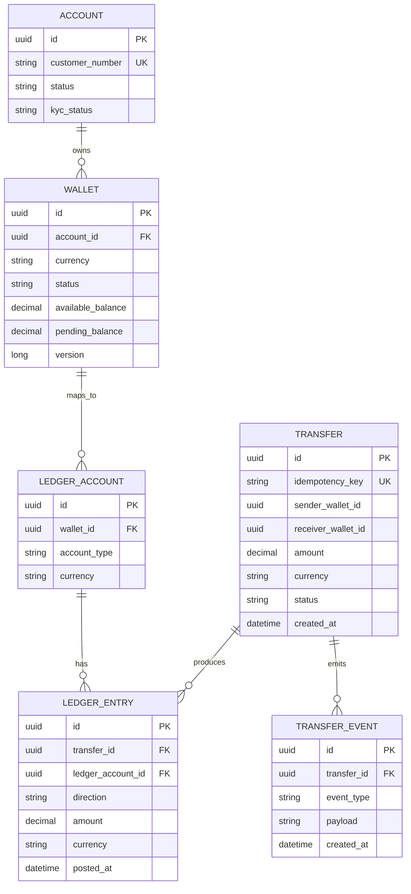

Ledger invariant:

```text
sum(debit entries) == sum(credit entries)
```

Bu invariant sağlanmadan transfer `COMPLETED` olamaz.

## 8. Core Flows

### Login Flow

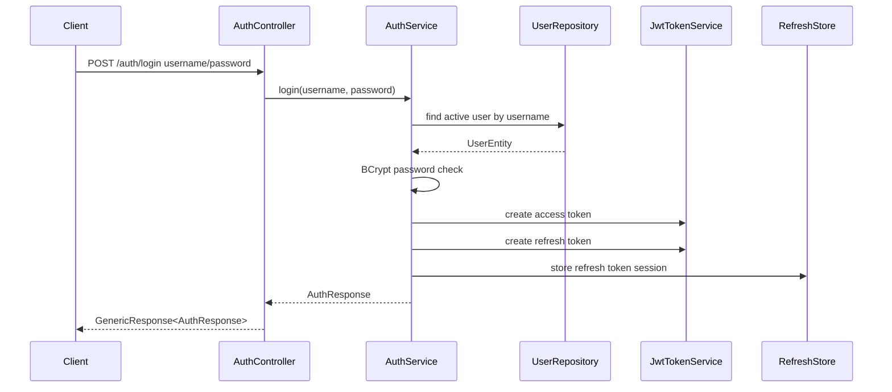

### Current Transfer Flow

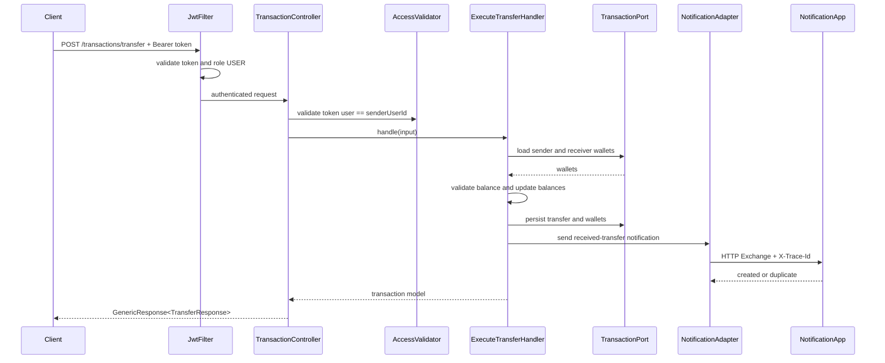

### Target Transfer Flow With Outbox

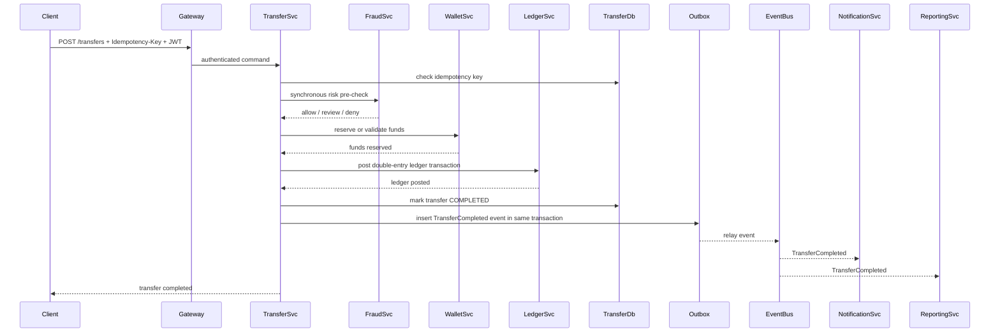

Burada notification ve reporting async tüketici olur. Transfer response bu tüketicilere bağlı kalmaz.

### Notification Idempotency

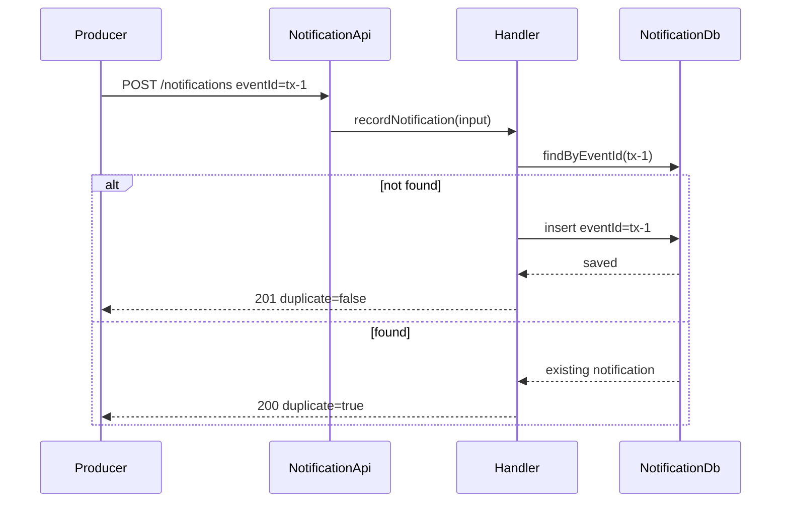

## 9. State Machines

### Transfer State

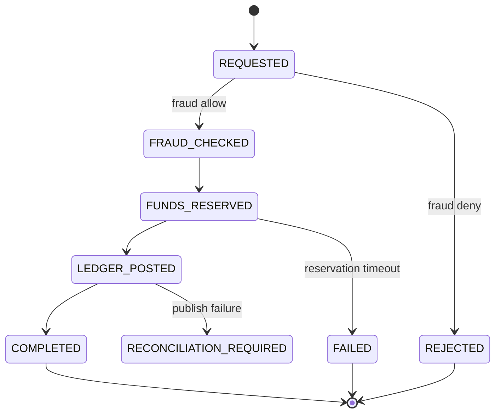

### Token State

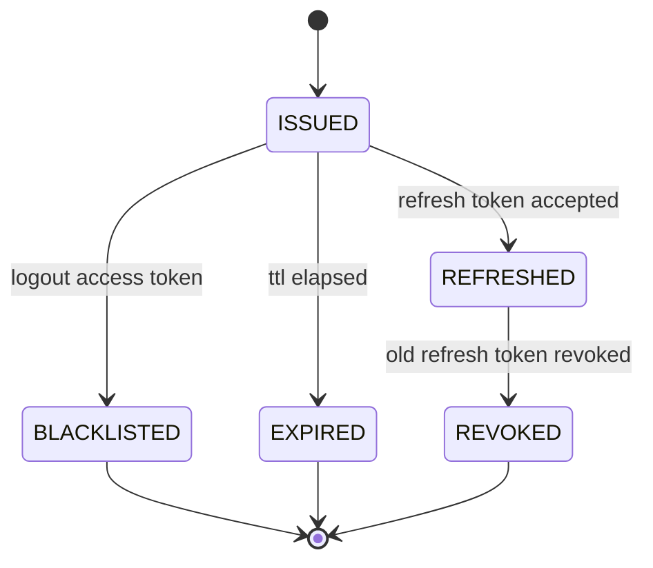

## 10. Consistency Strategy

### Current System

- Enterprise App transfer update'leri tek process ve tek database transaction sınırında tutulur.
- Wallet balance update ve transaction record aynı use case içinde yapılır.
- Notification HTTP call best effort kabul edilir.
- Notification App `eventId` ile idempotency sağlar.
- Audit fields ve trace ID kayıt üstünde tutulur.

### Enterprise Target

| Concern | Strategy |
|---|---|
| Debit-credit correctness | Single ledger transaction with double-entry invariant |
| Cross-service side effects | Transactional outbox |
| Async delivery | At-least-once event delivery + idempotent consumers |
| Duplicate client requests | Idempotency-Key per transfer command |
| Reporting consistency | Eventually consistent read model |
| Reconciliation | Periodic ledger balance verification jobs |

Important interview point:

```text
Exactly-once delivery is not assumed. The practical design is at-least-once delivery plus idempotent writes.
```

## 11. Security Design

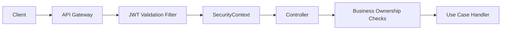

Mevcut sistemde:

- `JwtAuthenticationFilter` access token doğrular.
- `SecurityConfiguration` endpoint pattern bazlı rol kontrolü yapar.
- `CurrentUserProvider` kullanıcı kimliğini `SecurityContext` üzerinden okur.
- `TokenBlacklistService` logout edilmiş access token'ları tutar.
- `RefreshTokenStoreService` refresh session revoke mantığını yönetir.

Enterprise hardening:

- OIDC provider entegrasyonu
- KMS/HSM ile token secret ve encryption key yönetimi
- Redis veya distributed cache üzerinde blacklist ve idempotency store
- mTLS for service-to-service calls
- API Gateway rate limiting
- Fine-grained permission model
- Sensitive field masking in logs
- SIEM integration for suspicious auth events

## 12. Scalability

### Read vs Write Split

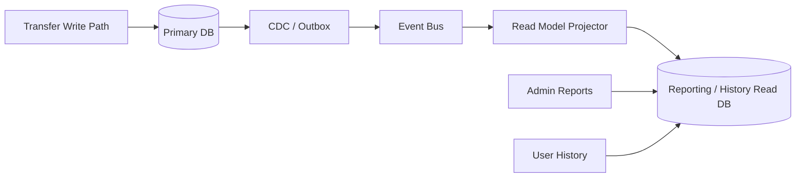

Scaling decisions:

| Area | Approach |
|---|---|
| Login/token blacklist | Redis cluster |
| Transaction history | Partition by user ID or wallet ID, read model for queries |
| Ledger writes | Partition by ledger account or wallet ID; avoid cross-partition hot transactions |
| Reports | Async projections; do not run heavy joins on OLTP DB |
| Notifications | Queue consumers with retry and DLQ |
| Fraud | Fast synchronous rules + async ML/risk enrichment |

### Capacity Thinking Example

| Metric | Example Target | Design Impact |
|---|---:|---|
| Registered users | 1M+ | User DB indexed by username/email |
| Transfers per day | 10M | Ledger partitioning, idempotency store, queue |
| Transfer p95 | < 300 ms | Keep fraud pre-check lightweight |
| Notification delivery | Eventually consistent | Async queue and retry |
| Transaction history p95 | < 500 ms | Read model and pagination |

## 13. Resilience and Failure Handling

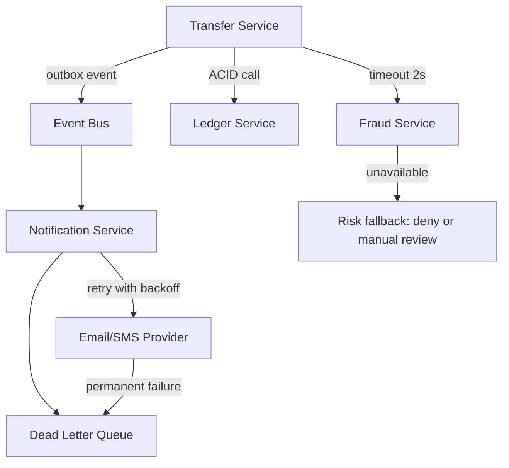

Failure policy examples:

| Failure | Policy |
|---|---|
| JWT invalid | 401 JSON error |
| Role mismatch | 403 JSON error |
| Insufficient balance | Business error, no ledger entry |
| Notification service down | Log + retry async; transfer remains completed |
| Event consumer duplicate | Idempotent eventId/idempotency key |
| Ledger invariant violation | Rollback and alert |
| Outbox relay down | Events remain in outbox table until relay recovers |

## 14. Observability

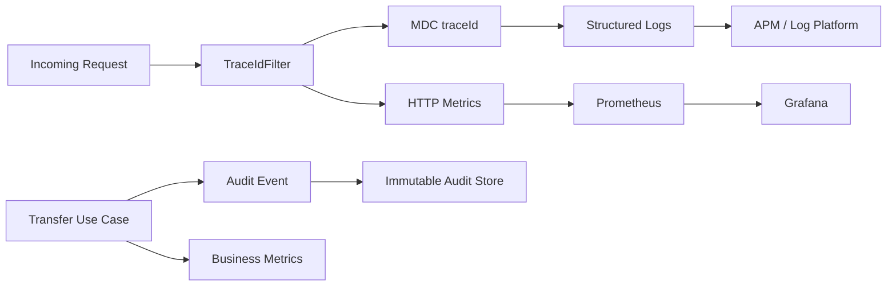

Minimum metrics:

- `http.server.requests`
- `auth.login.success/failure`
- `transfer.completed`
- `transfer.rejected`
- `transfer.failed`
- `notification.created`
- `notification.duplicate`
- `notification.delivery.failure`
- `fraud.report.query.duration`
- DB connection pool metrics

Minimum alerts:

- Transfer failure rate above threshold
- Ledger invariant mismatch
- Notification DLQ growth
- Auth failure spike
- High p95 latency on transfer
- Outbox backlog age above threshold

## 15. Deployment View

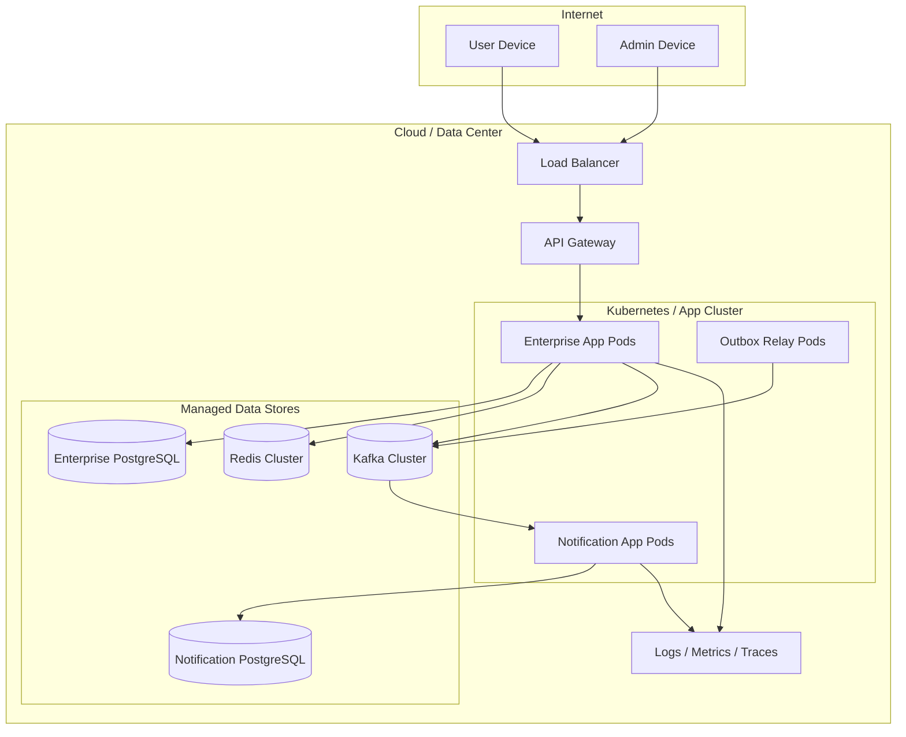

## 16. API Design Notes

Current APIs:

| API | Role |
|---|---|
| `POST /api/v1/auth/login` | Public |
| `POST /api/v1/auth/refresh` | Public |
| `POST /api/v1/auth/logout` | Authenticated |
| `POST /api/v1/users` | Public |
| `GET /api/v1/users/basic-list` | USER |
| `DELETE /api/v1/users/{userId}` | USER owner |
| `POST /api/v1/transactions/transfer` | USER sender |
| `GET /api/v1/transactions/history` | USER owner |
| `GET /api/v1/transactions/fraud-report` | ADMIN |
| `DELETE /api/v1/transactions/wallets/{walletId}` | USER owner |
| `POST /api/v1/notifications` | Internal service call |

Enterprise API improvements:

- Add `Idempotency-Key` header to transfer command.
- Return `202 Accepted` for async flows that enter manual fraud review.
- Use opaque external IDs instead of exposing internal IDs where needed.
- Add cursor-based pagination for large histories.
- Add versioned APIs: `/api/v2/transfers`.
- Add problem-details compatible error model if external consumers require it.

## 17. Trade-Offs

| Decision | Benefit | Cost |
|---|---|---|
| Modular monolith first | Simpler deployment, strong local consistency | Scaling per bounded context is limited |
| Split Notification App | Demonstrates service communication and idempotency | More operational surface |
| JWT stateless auth | Horizontally scalable APIs | Logout needs blacklist store |
| Outbox pattern | Reliable event publishing | Extra relay and storage complexity |
| Double-entry ledger | Strong financial auditability | More complex data model |
| CQRS for reporting | Fast reports without harming OLTP | Eventual consistency |
| Async notification | Transfer path remains stable | Notification may be delayed |

## 18. Interview Presentation Script

Kısa sunum akışı:

1. "Önce core requirement'i ayırırım: transfer para hareketidir, notification yan etkidir."
2. "Mevcut sistem modüler monolit; domain sınırları port/adapter ile ayrılmış."
3. "Transfer path güçlü tutarlı olmalı; notification best effort ve idempotent olmalı."
4. "Enterprise versiyonda transferi ledger merkezli tasarlarım; double-entry invariant ana güvenlik hattıdır."
5. "Servisler arası event için exactly-once varsaymam; outbox + at-least-once + idempotent consumer kullanırım."
6. "Auth tarafında Security Filter Chain, JWT, refresh token revoke, blacklist ve RBAC merkezi kalır."
7. "Raporlama OLTP DB'den ayrılır; event projection/read model ile büyütülür."
8. "Observability ve audit para sisteminde feature değil zorunluluktur."

## 19. What I Would Build Next

Öncelik sırası:

1. Transfer endpoint'e `Idempotency-Key` eklemek
2. Wallet balance için `Double` yerine `BigDecimal` kullanmak
3. Double-entry ledger modeli eklemek
4. Transactional outbox eklemek
5. Notification delivery'i queue consumer modeline almak
6. Refresh token ve blacklist store'u Redis'e taşımak
7. Reporting read model oluşturmak
8. Fraud kararını rule engine + async enrichment şeklinde büyütmek
9. Audit event store'u immutable hale getirmek
10. Deployment için Docker Compose veya Kubernetes manifestleri eklemek

## 20. Review Checklist

Interview sonunda kendime soracağım kontrol listesi:

- Para hareketi transaction boundary içinde mi?
- Duplicate request transferi iki kez çalıştırabilir mi?
- Notification başarısızlığı transferi geri alıyor mu?
- Raporlama OLTP write path'i yavaşlatıyor mu?
- Token logout ve refresh revoke davranışı net mi?
- Admin ve user endpoint erişimleri merkezi mi?
- Trace ID servisler arası taşınıyor mu?
- Audit bilgisi sonradan değiştirilemez şekilde saklanabilir mi?
- Manual fraud review için durum modeli hazır mı?
- Sistem hangi noktadan yatay scale edilecek?
